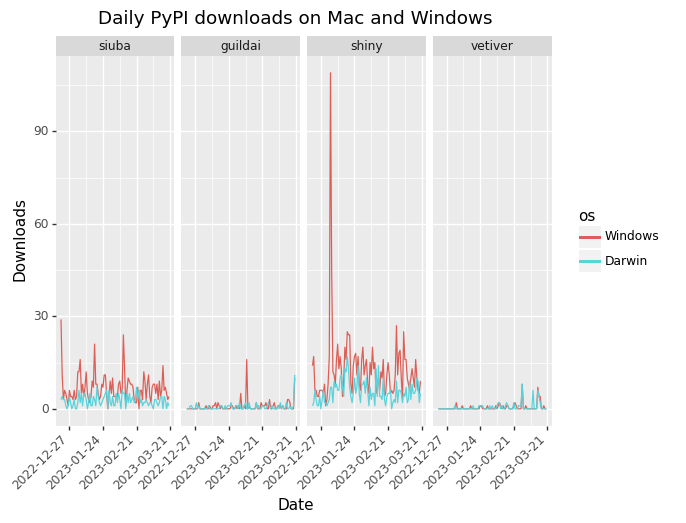
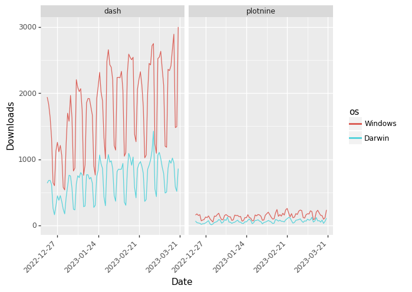

<details>
<summary>Code</summary>

``` python
import os

os.environ["PIPELINE_WAREHOUSE_URI"] = "bigquery://tidyverse-pipeline?maximum_bytes_billed=5525000000000"

from siuba import *
from siuba.sql import sql_raw
from siuba.experimental.datetime import floor_date
from siuba.dply.forcats import fct_reorder, fct_lump, fct_rev
from plotnine import *

from dbpal.tables import tbls


def replot(ggplot_obj):
    """Allow the re-use of a ggplot object.
    
    Note that this function returns a copy of the original, with data removed.
    """
    
    import copy
    
    new = copy.copy(ggplot_obj)
    new.data = None
    
    return new
```

</details>

**Author**: Michael Chow

This report looks at PyPI download information for several
Posit/Tidyverse open source repositories in the past 30 days. It uses
data [published by PyPI to
bigquery](https://packaging.python.org/en/latest/guides/analyzing-pypi-package-downloads/).

There are three big discoveries:

- Downloads from linux systems tend to be very high (likely due to
  machine processes).
- Repos like shiny, siuba, vetiver, and guildai tend to get 20 or fewer
  non-linux downloads a day.
- plotnine gets hundreds of non-linux downloads a day.

To help give a comparison to other tools, I included dash–whose
downloads are in the thousands.

## Fetching data

In order to fetch the data, I connected to bigquery, and queried the
table `` `bigquery-public-data`.pypi.file_downloads ``. Specifically, I
counted the number of downloads to Posit/Tidyverse related repos–along
with dash–in the past 30 days.

<details>
<summary>Code</summary>

``` python
res = tbls.query("""

SELECT timestamp, file.project AS repo, details.system.name AS os, COUNT(*) AS n
FROM `bigquery-public-data.pypi.file_downloads`
WHERE 
    file.project IN (
        'siuba', 'shiny', 'vetiver', 'htmltools', 'guildai', 'plotnine',
        'dash'
    )
    -- Only query the last 30 days of history
    AND (
        CAST(timestamp AS DATE) BETWEEN
        DATE_SUB(CURRENT_DATE(), INTERVAL 90 DAY)
        AND CURRENT_DATE()
    )
GROUP BY 1, 2, 3

""")

tbl_downloads_raw = res >> collect()
```

</details>
<details>
<summary>Code</summary>

``` python
tbl_downloads = (tbl_downloads_raw
    >> mutate(day = floor_date(_.timestamp, "D"))
)

tbl_downloads_daily = (
    tbl_downloads
    >> count(_.repo, _.day, _.os, wt=_.n, name="n_downloads")
    >> mutate(
        os = fct_lump(_.os.fillna("<Missing>"), n = 4)
    )
    # fill in missing zeros. note that this assumes at least
    # one repo has downloads for a given day
    >> complete(_.repo, _.day, _.os, fill={"n_downloads": 0})
    # order levels nicely
    >> mutate(
        repo = fct_reorder(_.repo, -_.n_downloads, "sum"),
        os = fct_reorder(_.os.astype(str), -_.n_downloads, "sum")
    )
)

plot_downloads = (
        ggplot(aes("day", "n_downloads", color = "os"))
       + facet_grid("~repo")
       + geom_line()
       + scale_x_date(date_breaks = "4 week")
       + theme(axis_text_x = element_text(angle = 45, hjust=1))
       + labs(x = "Date", y = "Downloads")
)
```

</details>

## Total downloads

Below is a plot of PyPI downloads over the past 30 days for all queried
repos, colored by operating system type.

<details>
<summary>Code</summary>

``` python
(tbl_downloads_daily
    >> count(_.repo, _.os, wt = _.n_downloads)
    >> ggplot(aes("fct_rev(repo)", "n", fill = "os"))
    + geom_col()
    + coord_flip()
    + labs(
        title = "Total PyPI Downloads in past 30 days",
        x = "Repository",
        y = "Downloads",
    )
)
```

</details>


    <ggplot: (8752052119138)>

Note two important pieces:

- Linux downloads overwhelm everything else. This makes sense for repos,
  where machine processes may be routinely installing packages (like
  dash, plotnine, and siuba).
- dash and plotnine have substantially more downloads.

To make it easy to see downloads, I’ll first show downloads over time
for packages with fewer downloads, and then loop back to the big ones.

<details>
<summary>Code</summary>

``` python
tbl_downloads_daily_small = (
    tbl_downloads_daily
    >> filter(~_.repo.isin(["dash", "plotnine"]))
)
```

</details>

## How many PyPI downloads happened in the last 30 days?

The plot below shows downloads, including from linux systems, for the
smaller projects.

<details>
<summary>Code</summary>

``` python
(tbl_downloads_daily_small
   >> replot(plot_downloads)
   + labs(title = "Daily PyPI Downloads on All Operation Systems")
)
```

</details>


    <ggplot: (8751890652359)>

Note that it’s hard to see what’s going on with so many linux downloads.
But also, it appears that some machine processes are downloading siuba
relatively frequently. Cutting out linux and missing operating systems
gives a glimpse into possibly more organic activity.

## How may downloads happened on just Mac and Windows?

The plot below shows downloads from Windows and Mac systems.

<details>
<summary>Code</summary>

``` python
(tbl_downloads_daily_small
   >> filter(_.os.isin(["Windows", "Darwin"]), _.repo != "htmltools")
   >> mutate(os = _.os.cat.remove_unused_categories())
   >> replot(plot_downloads)
   + labs(title = "Daily PyPI downloads on Mac and Windows")
)
```

</details>



    <ggplot: (8751908858688)>

Note that it looks like projects in this group get at most 10s of
downloads a day, with some days at 0 downloads.

One interesting piece above is that for projects like siuba and shiny,
windows downloads tend to be more frequent than mac laptops. This is a
pattern also shows up in the plotnine and dash data, in the next
section.

## Including plotnine and dash

The plot below includes daily downloads for plotnine and dash, which
have substantially more activity!

<details>
<summary>Code</summary>

``` python
(
    tbl_downloads_daily 
    >> filter(_.os.isin(["Windows", "Darwin"]), _.repo.isin(["dash", "plotnine"]))
    >> mutate(os = _.os.cat.remove_unused_categories())
    >> replot(plot_downloads)
)
```

</details>



    <ggplot: (8751910445840)>

Once piece that stands out is that the dash downloads appear to be
growing noticeably over time. Though, we should look at downloads
further into the past to get the full picture!

## Summary

In this report, I looked at PyPI downloads from the past 90 days. It
seems like download activity on non-linux systems for most packages is
pretty.

- Libraries like siuba, shiny, vetiver, and guildai get in the order of
  10s of downloads a day.
- plotnine (and dash) get hundreds a day.

Things worth thinking more about:

- What do downloads–even on windows and mac–reflect?
- How should we house this data, to make it easy to analyze for
  questions we care about?
- I’d be curious to look back at historical high-traffic moments for
  siuba, to see how that corresponds to downloads.

## Appendix: PyPI data notes

- **distribution_metadata**: package metadata (from package
  configuration files like `pyproject.toml`). For example, its `author`
  or `requires`.
  - required fields: name, version, md5_digest
  - grain: one row per project name and version (?)
- **file_downloads**:
  - required fields: timestamp, project, file (a record)
  - grain: one row per occasion where a project’s files are downloaded
- **simple_requests**:
  - required fields: timestamp, url, project
  - grain:

You can access tables using their full names, e.g.:

- `` `bigquery-public-data`.pypi.distribution_metadata ``
